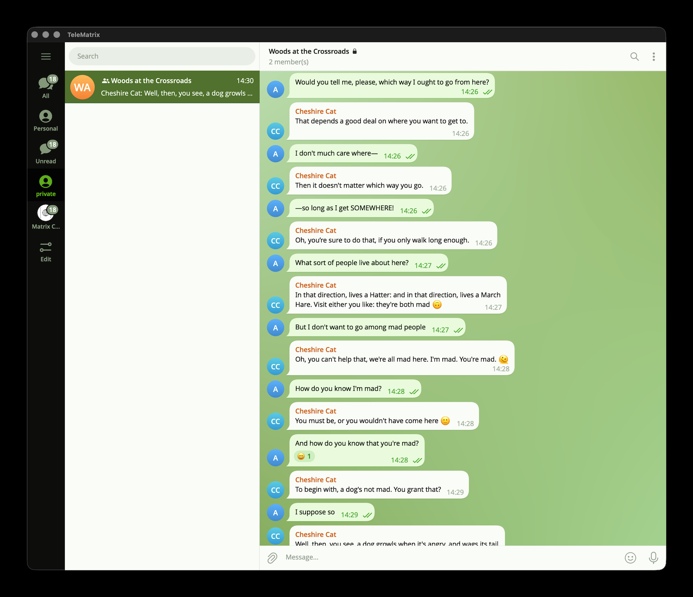

# TeleMatrix

[](https://github.com/gecka/TeleMatrix/actions/workflows/ci.yml)
[](https://github.com/gecka/TeleMatrix/releases/latest)
[](LICENSE)


A desktop **[Matrix](https://matrix.org)** client with the look and feel of **Telegram Desktop**.

TeleMatrix pairs a C++20 / Qt 6 front end — a partial, pixel‑oriented clone of the
Telegram Desktop interface — with a Rust back end built on
[`matrix-rust-sdk`](https://github.com/matrix-org/matrix-rust-sdk), linked in as a
static library over a small C FFI.

> This is an independent project and is not affiliated with Telegram,
> Telegram FZ‑LLC, or The Matrix.org Foundation.

---

<p align="center">
  
</p>

---

## Download

**[Download the latest release](https://github.com/gecka/TeleMatrix/releases/latest)** —
pick the file for your platform:

| Platform | File |
| --- | --- |
| macOS (Apple Silicon + Intel) | `TeleMatrix-<version>-universal.dmg` |
| Windows 10/11 (x64) | `TeleMatrix-<version>-win64.exe` |
| Linux (portable) | `TeleMatrix-<version>-x86_64.AppImage` |
| Debian / Ubuntu | `telematrix_<version>_amd64.deb` |
| Fedora / RHEL | `telematrix-<version>-1.x86_64.rpm` |

That link always resolves to the newest **stable** build. Beta and other
pre‑release builds are listed on the
[Releases page](https://github.com/gecka/TeleMatrix/releases).

---

## Highlights

- **Telegram‑style UI** — chat list, message bubbles, and controls are custom‑painted
  with `QPainter`, porting layout math and styling from Telegram Desktop.
- **Matrix back end** — login, sync, rooms, timelines, and message sending via
  `matrix-rust-sdk` (`matrix-sdk`, `matrix-sdk-ui`, `matrix-sdk-crypto`).
- **End‑to‑end encryption** — device verification (emoji SAS and QR) and recovery‑key flows,
  with encrypted local storage (SQLCipher).
- **Local data protection** — the Matrix access token and store keys live in the OS
  keychain or an encrypted master‑password vault; every local database is encrypted
  at rest.
- **Streaming video** — encrypted video plays inline via a local loopback proxy that
  decrypts on the fly (HTTP Range + seekable AES‑CTR), so playback starts without
  downloading the whole file first.
- **Chat organization** — folders and joined spaces sit side by side in the left rail,
  reorderable together. Folders are native Matrix room‑list **sections** (`m.tag`), so a
  section made in Element shows up here and vice versa.
- **Themes** — named palettes, each with matching day and night variants,
  switchable from the main menu.
- **Multiple accounts** — up to six accounts signed in at once, all syncing in the
  background, each with its own encrypted stores and secrets. Switch from the main menu
  or with `Ctrl/⌘+Shift+1…6`.
- **Saved Messages** — somewhere private to forward messages to yourself, kept as a room
  only you are in and created lazily the first time you use it.

---

## Minimum supported OS

| Platform | Minimum version | Notes |
| --- | --- | --- |
| macOS   | **15.0 (Sequoia)** | `CMAKE_OSX_DEPLOYMENT_TARGET`; the primary, actively‑tested platform. |
| Windows | **Windows 10** | Built against the Windows 10 SDK (C++/WinRT). |
| Linux   | **glibc ≥ Ubuntu 22.04** | The portable AppImage is built on Ubuntu 22.04; `.deb` / `.rpm` builds link the host distro's Qt 6. |

Build‑time toolchain requirements (Qt 6.10.1, rustc 1.96.0, gcc ≥ 12, FFmpeg) are covered
in [`BUILDING.md`](BUILDING.md).

---

## Privacy

**Nothing about you or your usage is tracked, monitored, or collected.** There is no
analytics, no telemetry, no crash reporting, and no "phone home" — and no TeleMatrix
server for any of it to reach, because this project ships a client, not a service.

A few details:

- **Link previews are fetched by your homeserver, not by your computer.** The client asks
  the homeserver's `preview_url` endpoint, so pasting a link never exposes your IP address
  to the linked site.
- **Media is only ever fetched from your homeserver** — avatars, images, files, video. The
  inline video player streams through a proxy bound to `127.0.0.1`, which is local to your
  machine and never listens on the network.
- **An update check tells GitHub very little.** It is a plain request for a fixed file, with
  a constant `TeleMatrix-Updater` user agent and no query parameters, so it carries neither
  your version nor your operating system; the comparison happens on your machine after the
  file arrives. GitHub sees what it sees for any anonymous download: an IP address. Choose
  *Never check for updates* and the app makes no automatic requests at all.

Where your data rests, rather than where it travels, is covered below in
[Local storage & data](#local-storage--data).

---

## Local storage & data

TeleMatrix keeps everything **local and encrypted**. Only non‑sensitive UI settings are
written in plaintext (`settings.json`); no access token or key is ever stored in the clear.

| Platform | Device settings (`settings.json`) | Per‑account encrypted stores |
| --- | --- | --- |
| macOS   | `~/Library/Application Support/TeleMatrix/settings.json` | `~/Library/Application Support/TeleMatrix/TeleMatrix/accounts/<n>/` |
| Windows | `%LOCALAPPDATA%\TeleMatrix\settings.json` | `%APPDATA%\TeleMatrix\TeleMatrix\accounts\<n>\` |
| Linux   | `~/.local/share/TeleMatrix/settings.json` | `~/.local/share/TeleMatrix/TeleMatrix/accounts/<n>/` |

`settings.json` also stores the account index — which `<n>` folders exist, which one is
active, and each account's **session details: homeserver, user ID, device ID, and which
secret backend holds its keys**. These are identifiers, not credentials: the access token
and every store passphrase live in the keychain or vault described below, never in this
file. Everything else lives inside each account's own folder.

**Encrypted‑at‑rest databases (SQLCipher / AES‑256).** Each store is opened with its own
random passphrase:

- `store/` — the `matrix-rust-sdk` state, crypto (E2EE device keys, Olm/Megolm sessions),
  event‑cache, and media stores.
- `search_index.db` — full‑text message search index.
- `app_cache.db` — rooms snapshot, cached folder list (for instant startup; the server
  copy is authoritative), recent emoji, media metadata.
- `preview_cache.db` — link / OG preview cache.
- `media_cache/` — downloaded media blobs (each file individually encrypted).

**Authentication & keys — where the secrets themselves live.** The Matrix access token and
every store passphrase are held in a *secret backend*, chosen on first run:

1. **OS keychain** (default) — macOS Keychain, Windows Credential Manager, or the Linux
   Secret Service (GNOME Keyring / KWallet).
2. **Private vault** — an encrypted file (`secret_vault.bin`) sealed with
   **XChaCha20‑Poly1305** under a key derived from a **master password** via **Argon2id**.
   A keyring‑free option that works on any platform, and the automatic fallback on Linux
   systems with no Secret Service.

On sign‑out the secret backend is cleared and the encrypted stores are removed, so a
logged‑out install retains no readable data.

---

## Matrix support

### Homeserver requirements

TeleMatrix syncs **exclusively over Simplified Sliding Sync ([MSC4186](https://github.com/matrix-org/matrix-spec-proposals/pull/4186))** —
`POST /_matrix/client/unstable/org.matrix.simplified_msc3575/sync`. There is **no sync‑v2
fallback**, so a homeserver that doesn't implement it cannot be used.

| Requirement | Detail |
| --- | --- |
| **Sync** | Simplified Sliding Sync (MSC4186). The server must advertise `org.matrix.simplified_msc3575` in `/_matrix/client/versions`. |
| **Synapse** | **≥ 1.114** ([native support](https://matrix.org/blog/2024/11/14/moving-to-native-sliding-sync/), Sept 2024). Depending on the release you may need `experimental_features: msc3575_enabled: true`. |
| **Sliding‑sync proxy** | **Not used and not needed** — the standalone proxy is sunset; TeleMatrix talks to the homeserver directly. |
| **Login** | `m.login.password` and registration (User‑Interactive Auth). **SSO / OIDC are not supported.** |

Check a homeserver in one line:

```sh
curl -s https://matrix.example.org/_matrix/client/versions | grep -o simplified_msc3575
```

Any homeserver implementing MSC4186 should work — **Synapse is the one TeleMatrix is developed
against**, and the code carries a few Synapse‑specific workarounds (e.g. its unimplemented
authenticated URL‑preview endpoint).

### Protocol

The Client‑Server API is spoken entirely through
[`matrix-rust-sdk`](https://github.com/matrix-org/matrix-rust-sdk) **0.18** (ruma 0.16) —
TeleMatrix implements no wire protocol of its own. Beyond the stable CS API it relies on:

- **E2EE** — Olm / Megolm, cross‑signing, server‑side key backup, and both SAS (emoji) and
  QR device verification.
- **Polls** — [MSC3381](https://github.com/matrix-org/matrix-spec-proposals/pull/3381),
  including client‑side vote tallying.
- **Call events** — [MSC4075](https://github.com/matrix-org/matrix-spec-proposals/pull/4075)
  RTC notifications are *rendered* in the timeline and chat list (see the limits below).
- **Media** — authenticated media (`/_matrix/client/v1/media/…`), falling back to the legacy
  `/_matrix/media/v3` endpoints, which Synapse still serves for URL previews.

---

## License

TeleMatrix is released under the **GNU General Public License v3.0 or later**, with an
**OpenSSL linking exception** — see [`LICENSE`](LICENSE) and [`LEGAL`](LEGAL).

Third‑party components and their licenses (matrix‑rust‑sdk, Qt, bundled fonts, Rust
crates, SQLite/SQLCipher, …) are listed in
[`THIRD_PARTY_NOTICES.md`](THIRD_PARTY_NOTICES.md). All of them are GPLv3‑compatible.

## Acknowledgements

- **[Telegram Desktop](https://github.com/telegramdesktop/tdesktop)** and the
  **[Desktop App Toolkit](https://github.com/desktop-app)** — the UI reference this
  project is modeled on.
- **[matrix-rust-sdk](https://github.com/matrix-org/matrix-rust-sdk)** — the Matrix
  protocol implementation powering the back end.
- **[Codex](https://openai.com/codex)** and
  **[Claude Code](https://claude.com/claude-code)** — TeleMatrix was built with these
  AI coding agents.
